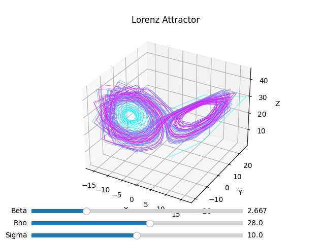
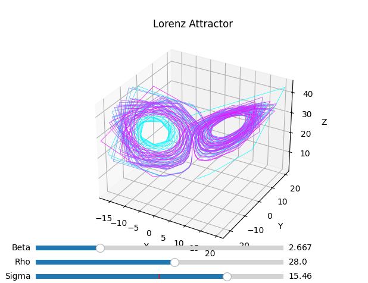
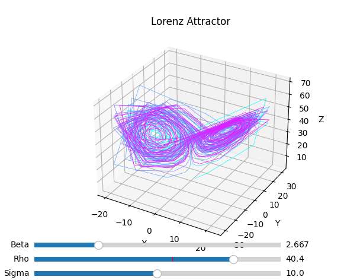
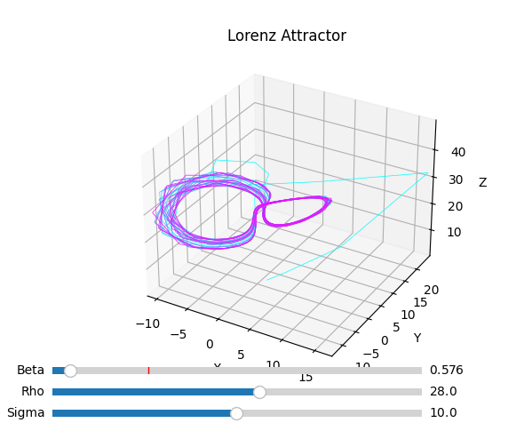

# Lorenz Attractor: A Chaos Theory Demonstration

## Overview
This is a demonstration of the Lorenz Attractor, a system of differential equations that exhibits chaotic behaviour. The Lorenz system is a simplified model of atmospheric convection and is a common example of chaos in mathematical systems.

In this implementation, the Lorenz system is solved numerically using the fourth-order Runge-Kutta (RK4) method. The solution is visualised in 3D to illustrate the chaotic trajectory of the system's state variables: *x*, *y*, and *z*.
## Key Features

- **Interactive Sliders**: Key parameters of the Lorenz system can be adjusted to observe the effects on the chaotic trajectory.
- **Real-time Plotting**: The Lorenz attractor is updated dynamically as the parameters are adjusted.
- **3D Visualization**: The chaotic behavior is displayed in a 3D space to better visualize the complex trajectory.

## Parameters

The Lorenz system is defined by three parameters: σ, ρ, and β. These parameters govern the behavior of the system and can be adjusted using sliders. Below is a description of each parameter:

### 1. Sigma (σ)

- Controls the Prandtl number, which is a measure of the fluid's viscosity to thermal diffusivity ratio.
- Typical values: 0.1 to 20.
- Higher values lead to faster changes in the system's state.

### 2. Rho (ρ)

- Controls the Rayleigh number, which influences the convective heat transfer.
- Typical values: 0.1 to 50.
- Larger values make the system more prone to chaotic behavior.

### 3. Beta (β)

- Controls the aspect ratio of the system's convective cells.
- Typical values: 0.1 to 10.
- Varying β affects the overall shape of the attractor.

## Initial Conditions

- The initial conditions for *x*, *y*, and *z* are all set to **1.0**.
- Time step *dt* is set to **0.01**, and the number of steps is **10000**.

## Real-time Interaction

The following sliders allow you to modify the parameters in real-time and observe the corresponding changes in the Lorenz attractor:

- **Sigma**: Controls the speed of the system's evolution.
- **Rho**: Influences the divergence of the attractor.
- **Beta**: Affects the system's stability and periodicity.

## Example Screenshots

### 1. Lorenz Attractor with Default Parameters:

### 2. Adjusted Sigma Parameter:

### 3. Adjusted Rho Parameter:

### 4. Adjusted Beta Parameter:

## Instructions

1. Use the sliders to adjust σ, ρ, and β to observe different behaviours of the Lorenz attractor.
2. The plot will update in real-time as you modify the parameters.
3. You can experiment with different combinations to explore the system's sensitivity to initial conditions and the chaotic patterns that emerge.
